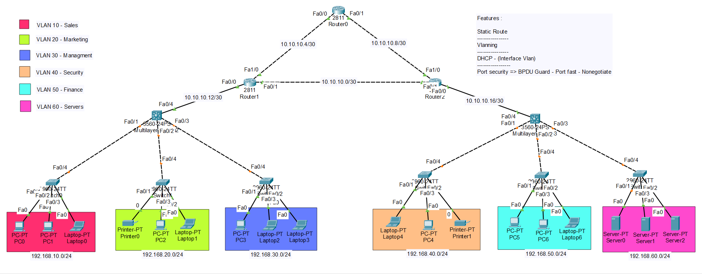

# CCNA Enterprise Campus Network

## Overview

This project demonstrates the design and implementation of an enterprise campus network using Cisco Packet Tracer.

The network is segmented into multiple departments through VLANs and utilizes multilayer switching for Inter-VLAN communication. DHCP services are deployed for automatic IP address allocation, while static routing enables communication between remote network segments.

The topology follows common enterprise networking principles, focusing on scalability, security, and efficient traffic management.

---

## Network Topology

---

## Network Components

### Routers
- 3 Cisco Routers

### Multilayer Switches
- 2 Cisco Multilayer Switches

### Access Switches
- 6 Cisco Access Switches

### End Devices
- Multiple PCs
- Dedicated Servers

---

## VLAN Structure

| VLAN ID | Department | Network |
|----------|------------|------------|
| 10 | Sales | 192.168.10.0/24 |
| 20 | Marketing | 192.168.20.0/24 |
| 30 | Management | 192.168.30.0/24 |
| 40 | Security | 192.168.40.0/24 |
| 50 | Finance | 192.168.50.0/24 |
| 60 | Server Farm | 192.168.60.0/24 |

---

## Implemented Technologies

### Layer 2 Technologies

- VLAN Segmentation
- IEEE 802.1Q Trunking
- PortFast
- BPDU Guard
- Port Security

### Layer 3 Technologies

- Inter-VLAN Routing
- Static Routing
- IP Address Planning
- Network Segmentation

### Network Services

- DHCP Configuration
- Gateway Configuration
- End-to-End Connectivity

---

## Security Features

The following security mechanisms were implemented:

- Port Security
- BPDU Guard
- PortFast
- VLAN Segmentation
- Dedicated Server VLAN

These features help improve access-layer security and reduce the risk of unauthorized network access.

---

## Routing Design

Communication between remote network segments is achieved through static routing.

The routing infrastructure provides connectivity between all VLANs and remote network locations while maintaining a simple and efficient routing architecture.

---

## Verification Tests

The following tests were successfully completed:

- DHCP Address Assignment
- Inter-VLAN Communication
- Router-to-Router Connectivity
- End-to-End Reachability
- VLAN Isolation Validation
- Static Route Verification

---

## Skills Demonstrated

- Enterprise Network Design
- Cisco Switching
- Cisco Routing
- VLAN Deployment
- DHCP Configuration
- Static Routing
- Network Security Fundamentals
- Troubleshooting and Verification

---

## Future Enhancements

Potential future improvements include:

- OSPF Deployment
- ACL Implementation
- EtherChannel
- HSRP Redundancy
- NAT/PAT
- NTP
- Syslog
- SNMP Monitoring

---

## Technologies Used

- Cisco Packet Tracer
- Cisco IOS
- Layer 2 Switching
- Layer 3 Switching
- Enterprise Networking Concepts

---

## Author

**Amirhossein Rahmati**

Network & Infrastructure Enthusiast

CCNA | VMware vSphere | MTCNA Candidate 
